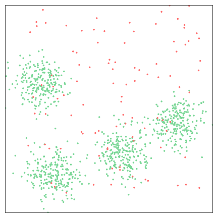
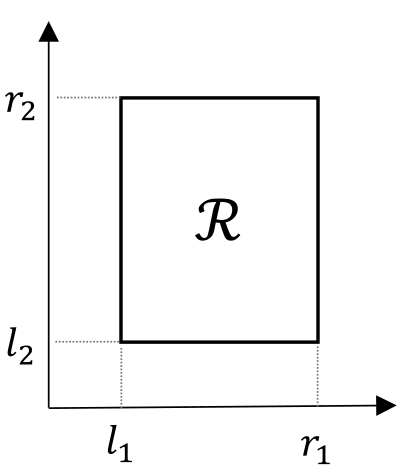
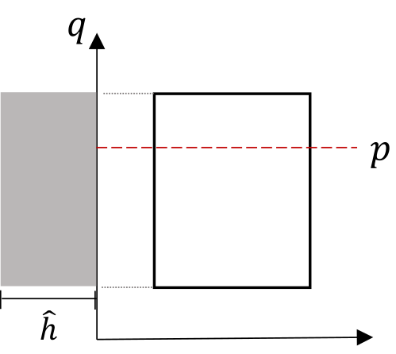
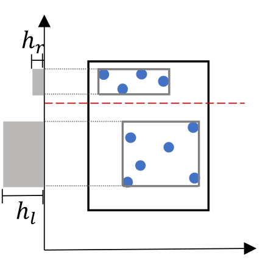
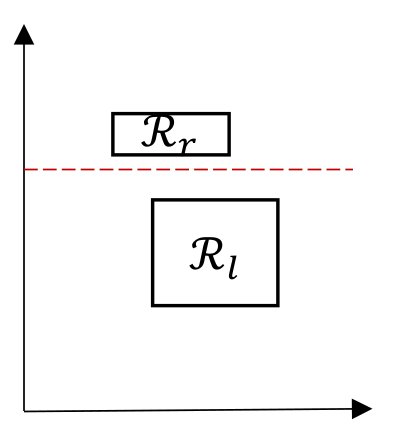
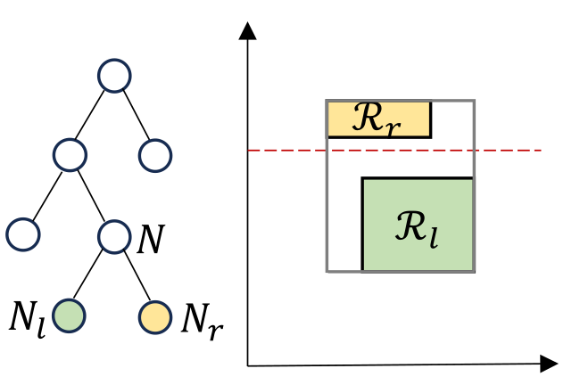
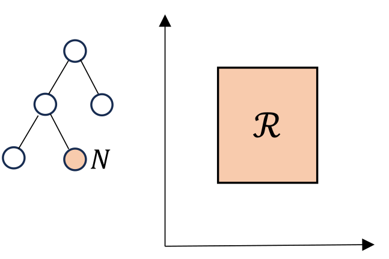

# Online Isolation Forest [[1]](#1)

The anomaly detection literature is abundant with offline methods, which require repeated access to data in memory, and 
impose impractical as sumptions when applied to a streaming context.
*Online Isolation Forest* is an anomaly detection algorithm explicitly designed for streaming conditions, and it 
seamlessly tracks the data generating process as it evolves over time.

<p align="center">
  
  
   
  
  
</p>

In the image above we illustrate the online learning capabilities of *Online Isolation Forest* with a toy example. 
Genuine data, depicted in green, are more densely distributed than anomalous data, represented in red. 
*Online Isolation Forest* processes points one at a time (i.e., in a streaming fashion), and assigns an anomaly score 
to each of them. As the stream continues, *Online Isolation Forest* acquires more information about the data distribution and refines the estimate of the
anomaly scores accordingly.

*Online Isolation Forest* is a forest of *d*-dimensional multi-resolution histograms constructed by recursively 
splitting the input space $`\mathbb{R}^d`$ into bins, such that each bin stores the number of points that fell in the 
corresponding region of the space.
Each histogram, called *Online Isolation Tree*, evolves its bins, both in terms of structure and the associated height, 
as it collects more information about the data distribution. An *Online Isolation Tree* is a dynamic collection of nodes
that is continuously updated as new points are learned and old points are forgotten by the tree.
We rely on a sliding buffer $`W = [\boldsymbol{x}_{t-\omega}, \dots, \boldsymbol{x}_{t}]`$ containing the $`\omega`$ 
most recent points and, at each time instant $`t`$, we use the most and least recent points $`\boldsymbol{x}_{t}`$ and 
$`\boldsymbol{x}_{t-\omega}`$ from the buffer $`W`$ to respectively expand and contract the tree accordingly.

### Learning Procedure
When a new sample $`\boldsymbol{x}_t`$ is received from the data stream we run, independently on each 
*Online Isolation Tree*, a learning procedure to update the tree. The learning procedure involves sending the incoming 
sample $`\boldsymbol{x}_t`$ to the corresponding leaf of the *Online Isolation Tree*, and updating the heights $`h`$ 
and bin supports $`\mathcal{R}`$ of all the bins along the path accordingly. When a leaf reaches the maximum height 
$`\hat{h}`$, we split the corresponding bin in two according to the procedure illustrated in the image below and 
described thoroughly in [[1]](#1).

<p align="center">
  
  
   
  
</p>

The learning procedure is repeated until the window $`W`$ gets full then, together with the learning procedure for the 
new incoming sample $`\boldsymbol{x}_t`$, we include a forgetting procedure for the oldest sample 
$`\boldsymbol{x}_{t−\omega}`$ in $`W`$.

### Forgetting procedure
In contrast to the learning procedure, which involves generating new nodes and thereby enhancing the resolution of 
*Online Isolation Tree* in that area, in the forgetting procedure we eventually aggregate nodes and merge the associated
bins, ultimately reducing the histogram resolution in the corresponding region of the space. The image below illustrates
the forgetting procedure, detailed in [[1]](#1).
<p align="center">
  
  
</p>

<hr>

### Reproducibility
In this repository you can find the [datasets](datasets) and [scripts](experiments/scripts/test) used to 
benchmark *Online Isolation Forest* and competing methods in [[1]](#1).  
This repository also includes scripts used to 
[plot](experiments/scripts/plot) results, as well as the [results and figures](experiments/results) used in 
[[1]](#1).
> Please note that due to the large size of some results, we have used [git-LFS](https://git-lfs.com/).
You will need to install git-LFS to correctly clone the repository.

> Please be aware that to correctly run the [scripts](experiments/scripts/test) used for benchmarking, you must adjust the pysad implementation of 
> *Isolation Forest-ASD* to allow for a different number of tree estimators other than the default.  
> Specifically, you need to modify the following lines in the file 
> `python3.10/site-packages/pysad/models/iforest_asd.py` from:
> >     def __init__(self, initial_window_X=None, window_size=2048):
> >         super().__init__(IForest, window_size, window_size, initial_window_X)
> to:
> >     def __init__(self, initial_window_X=None, window_size=2048, **kwargs):
> >         super().__init__(IForest, window_size, window_size, initial_window_X, **kwargs)

<hr>

### Demo
[This](OnlineIForest) folder contains a Python implementation of the *Online Isolation Forest* algorithm.  
Additionally, you can find a demo of the algorithm in [this](Online-iForest_demo.py) file.  
In order to play with the demo you just need to:
1. Clone the repo locally.
2. Install dependencies listed in the [requirements](requirements.txt) file.
3. Run [Online-iForest_demo](Online-iForest_demo.py).

<hr>

#### Online Isolation Forest in CapyMOA
*Online Isolation Forest* is part of the new release of [CapyMOA](https://capymoa.org/) Machine learning library tailored for data streams!!!
There you can find [Installation](https://capymoa.org/installation.html) instructions, [Anomaly Detection](https://capymoa.org/notebooks/anomaly_detection.html) tutorials and [Online Isolation Forest](https://capymoa.org/api/modules/capymoa.anomaly.OnlineIsolationForest.html#capymoa.anomaly.OnlineIsolationForest) documentation. 

<hr>

#### BibTex Citation
<a id="1">[1]</a>  
If you find *Online Isolation Forest* useful in your scientific publication, we would appreciate using the following 
citation:
```
@inproceedings{Leveni2024,
    title        = {Online Isolation Forest},
    author       = {Leveni, Filippo and Weigert Cassales, Guilherme and Pfahringer, Bernhard and Bifet, Albert and Boracchi, Giacomo},
    booktitle    = {Proceedings of the 41st International Conference on Machine Learning (ICML)},
    volume       = {235},
    pages        = {27288--27298},
    year         = {2024},
    editor       = {Salakhutdinov, Ruslan and Kolter, Zico and Heller, Katherine and Weller, Adrian and Oliver, Nuria and Scarlett, Jonathan and Berkenkamp, Felix},
    series       = {Proceedings of Machine Learning Research (PMLR)},
    month        = {21--27 Jul},
    url          = {https://proceedings.mlr.press/v235/leveni24a.html},
}
```
